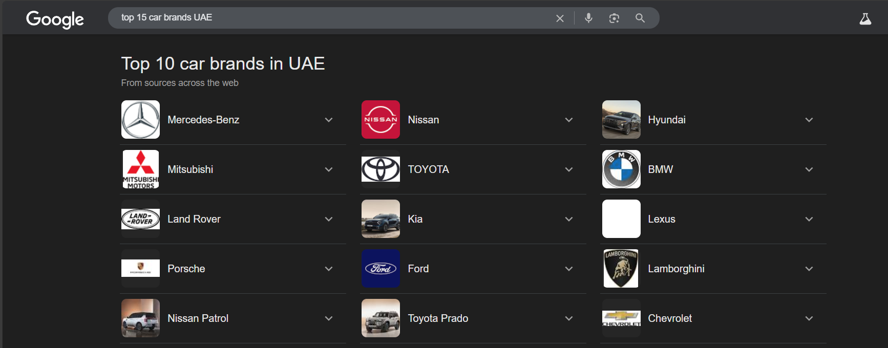

# UAE Used Car Price Analysis


An exploratory data analysis (EDA) project on the used car market in the United Arab Emirates. This analysis aims to uncover pricing trends, brand popularity, and the impact of key vehicle features like mileage and age on resale value.


## About The Project

This project performs a comprehensive analysis of over 10,000 used car listings from the UAE. The goal is to provide actionable insights for both buyers and sellers in the market. By cleaning, exploring, and visualizing the data, we can answer key questions about the factors that drive used car prices.

The main objectives of this analysis are to:
*   Clean and preprocess the raw dataset to make it suitable for analysis.
*   Analyze the distribution of key features such as Price, Mileage, and Year.
*   Identify the most popular car brands, models, and body types in the UAE market.
*   Explore the relationships between car price and its most influential features.
*   Investigate how prices differ across major cities like Dubai, Abu Dhabi, and Sharjah.

## Dataset

The dataset was aggregated from various UAE car platforms in March 2025 and contains 10,000 listings. It is publicly available on GitHub.

*   **Source:** [mido-saad/uae-car-analsis](https://github.com/midosaad254/uae-car-analsis)

### Column Descriptions
*   **Make**: The brand of the car (e.g., Toyota, Nissan).
*   **Model**: The specific model of the car (e.g., Camry, Patrol).
*   **Year**: Manufacturing year of the car.
*   **Price**: Listing price in AED (United Arab Emirates Dirham).
*   **Mileage**: Total distance driven in kilometers.
*   **Body Type**: The vehicle's body style (e.g., Sedan, SUV).
*   **Cylinders**: Number of engine cylinders.
*   **Transmission**: Gearbox type (e.g., Automatic, Manual).
*   **Fuel Type**: The type of fuel the car uses (e.g., Gasoline, Diesel).
*   **Color**: Exterior color of the car.
*   **Location**: The emirate where the car is listed (e.g., Dubai, Abu Dhabi).
*   **Description**: Seller's text description, often including features and condition.

## Tech Stack

This project is built using the following core data science libraries:
*   **Python:** The primary programming language.
*   **Pandas:** For data manipulation and cleaning.
*   **Matplotlib & Seaborn:** For data visualization.

## Getting Started

To get a local copy up and running, follow these simple steps.

### Prerequisites

You need to have Python 3.8+ and pip installed on your system.

### Installation

1.  **Clone the repo**
    ```sh
    git clone https://github.com/your_username/your_repository_name.git
    cd your_repository_name
    ```
2.  **Create and activate a virtual environment (recommended)**
    ```sh
    # For Windows
    python -m venv venv
    .\venv\Scripts\activate

    # For macOS/Linux
    python3 -m venv venv
    source venv/bin/activate
    ```
3.  **Install the required packages**
    ```sh
    pip install -r requirements.txt
    ```
    *(You will need to create a `requirements.txt` file containing `pandas`, `matplotlib`, and `seaborn`)*.

4.  **Run the analysis script**
    ```sh
    python used_car_analysis.py
    ```
    This will print statistical summaries to the console and save all generated plots to the `images/` directory.

## Exploratory Data Analysis (EDA)

The EDA reveals several key trends in the UAE's used car market.

### Key Visualizations

**1. Top 15 Most Listed Car Brands**
<br>Toyota, Nissan, and Mercedes-Benz are the most frequently listed brands, indicating their dominance and high turnover in the second-hand market.


**2. Price vs. Manufacturing Year**
<br>There is a clear positive trend: newer cars command higher prices. A noticeable drop occurs for cars older than 10-15 years.


**3. Price vs. Mileage**
<br>As expected, there is a strong negative correlation between mileage and price. Cars with lower mileage are significantly more expensive.


**4. Price Distribution by Location**
<br>Dubai shows the widest price range and the highest median price, suggesting a larger market for both budget-friendly and high-end luxury cars compared to other emirates.


## Model Training & Results (Future Work)

The EDA strongly supports the hypothesis that a car's `Year`, `Mileage`, and `Make` are primary drivers of its price. The next logical step for this project is to build a predictive model.

A potential approach would be:
1.  **Feature Engineering:**
    *   One-hot encode categorical features like `Make`, `Body Type`, and `Location`.
    *   Extract condition information (e.g., 'accident history', 'engine repaired') from the `Description` column.
2.  **Model Selection:**
    *   Train a baseline **Linear Regression** model to understand linear relationships.
    *   Implement a more powerful model like **Gradient Boosting** (e.g., XGBoost, LightGBM) or a **Random Forest Regressor** to capture non-linear patterns and provide feature importance scores.
3.  **Evaluation:**
    *   Evaluate model performance using metrics like Mean Absolute Error (MAE), Root Mean Squared Error (RMSE), and R-squared (R²).

## Conclusion

This analysis provides a clear overview of the UAE used car market based on the provided dataset. The key takeaways are:

*   **Market Leaders:** Japanese and German brands, particularly Toyota, Nissan, and Mercedes-Benz, are the most prevalent.
*   **Price Determinants:** A car's age (`Year`) and `Mileage` are the two most critical factors influencing its price, as shown by the strong correlations.
*   **Regional Differences:** Car prices and availability vary by location, with Dubai being the largest and most diverse market.

The initial hypothesis that a car's year, mileage, and brand are the most significant predictors of its price is strongly supported by the data visualizations.

## License

Distributed under the MIT License. See `LICENSE` for more information.
